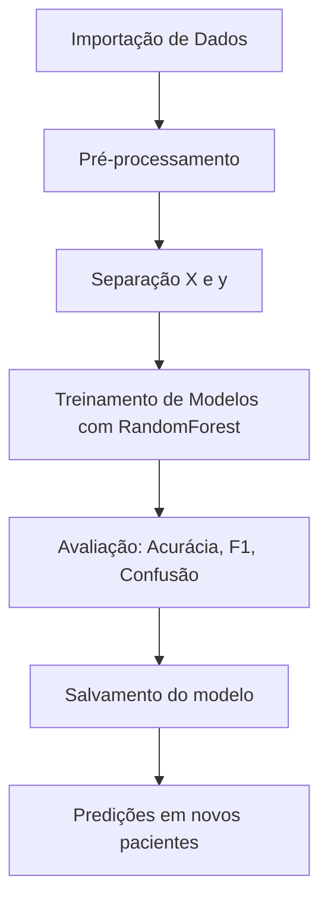

# 🧬 AnemiaClassifierML

> **Diagnóstico inteligente de tipos de anemia com Machine Learning**  
> Projeto orientado a dados clínicos para apoiar a tomada de decisão médica.

---

## 📌 Visão Geral

O **AnemiaClassifierML** é um sistema baseado em aprendizado de máquina supervisionado capaz de **prever e classificar diferentes tipos de anemia** com base em exames laboratoriais, como hemograma completo.  
A proposta é fornecer um apoio rápido, automatizado e confiável para médicos e profissionais de saúde, otimizando o diagnóstico clínico.

---

## 🧠 O que é Anemia?

A anemia é uma condição caracterizada pela **redução da quantidade de hemoglobina ou glóbulos vermelhos no sangue**, afetando a capacidade de transporte de oxigênio. Pode ter diferentes causas, incluindo:

- 🔬 Deficiência de ferro
- 🧪 Problemas na produção de células
- 🧬 Doenças hereditárias (ex: células falciformes)

A **classificação correta** do tipo de anemia é essencial para o tratamento adequado.

---

## 🎯 Objetivos do Projeto 

| Tipo de Objetivo | Descrição |
|------------------|-----------|
| 🎯 Geral         | Construir um classificador de tipos de anemia com base em aprendizado supervisionado. |
| 🔍 Específicos   | - Pré-processar os dados laboratoriais<br>- Treinar modelos de classificação<br>- Avaliar desempenho com métricas clínicas<br>- Salvar modelos e permitir reuso |

---

## ⚙️ Pipeline do Projeto





---

## 🗃️ Estrutura do Projeto

```
AnemiaClassifierML/
├── data/                  # Dataset original (.csv)
├── models/                # Modelos treinados (.pkl)
├── notebooks/             # Notebooks Jupyter (opcional)
├── scripts/               # Pipeline de ML
│   ├── preprocessing.py
│   ├── train_model.py
│   └── evaluate_model.py
├── utils/                 # Utilitários (salvar/carregar modelos)
│   └── helpers.py
├── setup_anemia_project.sh
└── README.md
```

---

## 🚀 Como Executar o Projeto

### 1. Clone o repositório

```bash
git clone https://github.com/ViniciusKanh/AnemiaClassifierML.git
cd AnemiaClassifierML
```

### 2. Instale as dependências

```bash
pip install -r requirements.txt
# ou instale manualmente:
pip install pandas scikit-learn numpy joblib
```

### 3. Coloque o dataset

Salve o arquivo `AnemiaTypesClassification_data.csv` dentro da pasta `data/`.

### 4. Treine o modelo

```bash
python scripts/train_model.py
```

### 5. Avalie o modelo

```bash
python scripts/evaluate_model.py
```

---

## 📊 Resultados Esperados

| Modelo             | Acurácia | F1-Score (weighted) |
|--------------------|----------|---------------------|
| 🎯 Random Forest    | ~99%     | ~0.99               |
| 🧪 Logistic Regression | ~69%     | ~0.68               |

> 🔎 *Os resultados podem variar de acordo com a base utilizada.*

---

## 🤖 Exemplo de Predição

```python
import joblib
import pandas as pd

model = joblib.load("models/random_forest_model.pkl")
le = joblib.load("models/label_encoder.pkl")

paciente = pd.DataFrame([{
    'WBC': 7.0, 'LYMp': 30.0, 'NEUTp': 60.0, 'LYMn': 2.1, 'NEUTn': 4.2,
    'RBC': 4.5, 'HGB': 12.0, 'HCT': 35.0, 'MCV': 90.0, 'MCH': 30.0,
    'MCHC': 33.0, 'PLT': 250.0, 'PDW': 12.0, 'PCT': 0.2
}])

pred = model.predict(paciente)
print("Diagnóstico previsto:", le.inverse_transform(pred)[0])
```

---

## 🧪 Tecnologias Utilizadas

- 🐍 Python 3.11
- 🤖 Scikit-Learn
- 📊 Pandas, NumPy
- 💾 Joblib
- 📈 Métricas: `accuracy_score`, `f1_score`, `classification_report`

---

## 👨‍⚕️ Viabilidade Clínica

Este projeto visa ser uma **prova de conceito científica** para uso em contextos de triagem ou apoio diagnóstico.  
Apesar dos resultados promissores, recomenda-se que seja **validado com apoio de profissionais médicos e dados clínicos reais**.

---

## 👨‍💻 Autor

**Vinicius de Souza Santos**  
📧 vinicius.santos@ifsp.edu.br  
🔗 [linkedin.com/in/viniciuskanh](https://linkedin.com/in/viniciuskanh)

---

## 📚 Licença

Este projeto está sob a Licença MIT. Consulte o arquivo `LICENSE` para mais detalhes.

---

> 💡 _Ciência e saúde de mãos dadas com a tecnologia._  
> _Um passo rumo à medicina preditiva e orientada por dados._
