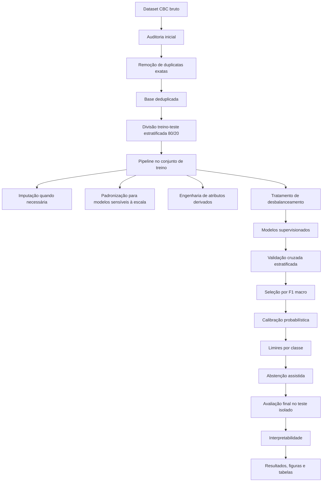
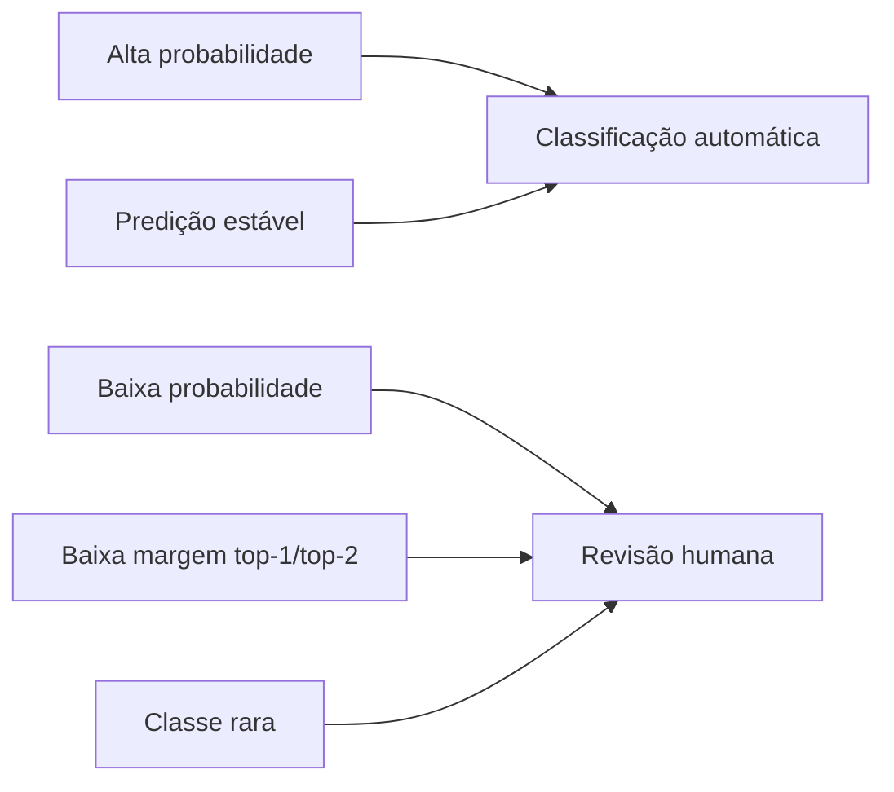
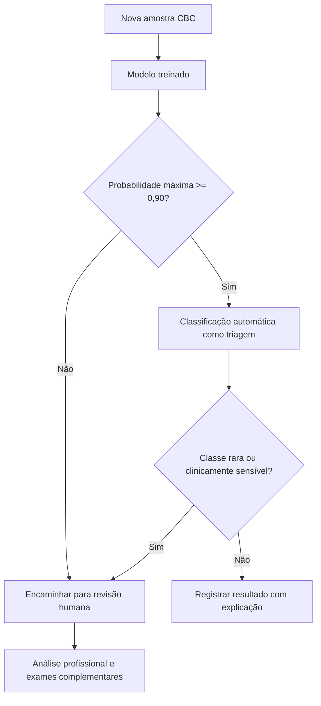
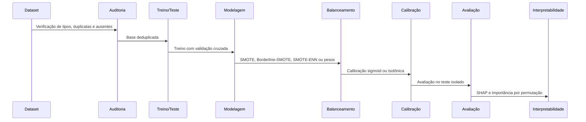

# 🧬 AnemiaClassifierML

<div align="center">


</div>

> **Triagem fenotípica de anemias baseada em hemograma completo com aprendizado de máquina**  
> Protocolo experimental reprodutível para classificação baseada em CBC, com auditoria de dados, tratamento de desbalanceamento, calibração probabilística, abstenção assistida e interpretabilidade.

---

## ⚠️ Aviso clínico importante

Este projeto tem finalidade **científica, educacional e experimental**.

Os modelos disponibilizados neste repositório **não realizam diagnóstico clínico definitivo** e **não substituem**:

- avaliação médica;
- revisão humana;
- exames laboratoriais complementares;
- investigação etiológica;
- protocolos clínicos institucionais.

O objetivo é apoiar a **triagem fenotípica** e a **análise computacional exploratória** a partir de variáveis do hemograma completo, também conhecido como *Complete Blood Count* (CBC).

---

## 📌 Visão geral

O **AnemiaClassifierML** implementa um protocolo de aprendizado de máquina para classificar fenótipos hematológicos associados a anemias e alterações correlatas usando exclusivamente variáveis de hemograma completo.

O projeto foi desenvolvido como apoio experimental ao artigo:

> **Triagem fenotípica de anemias baseada em hemograma completo: um protocolo calibrado, interpretável e sensível ao desbalanceamento de classes**

A proposta central não é apenas treinar um classificador, mas estruturar um fluxo metodológico completo, com foco em:

- auditoria e limpeza da base;
- prevenção de vazamento de informação;
- engenharia de atributos hematológicos derivados;
- comparação entre diferentes modelos supervisionados;
- tratamento de desbalanceamento de classes;
- calibração probabilística;
- limiares específicos por classe;
- abstenção assistida para casos incertos;
- interpretabilidade global e por classe.

---

## 🧠 Contexto científico

A anemia é uma condição caracterizada por redução da concentração de hemoglobina, da quantidade de eritrócitos circulantes ou da capacidade global de transporte de oxigênio pelo sangue.

O hemograma completo é amplamente utilizado como exame inicial para triagem de alterações hematológicas, pois contém informações como:

- hemoglobina;
- hematócrito;
- contagem de eritrócitos;
- volume corpuscular médio;
- hemoglobina corpuscular média;
- concentração de hemoglobina corpuscular média;
- leucócitos;
- neutrófilos;
- linfócitos;
- plaquetas.

Entretanto, o CBC isolado **não substitui** marcadores como ferritina, vitamina B12, folato, ferro sérico, transferrina ou avaliação clínica. Por isso, este projeto trata a tarefa como **triagem fenotípica baseada em CBC**, e não como diagnóstico definitivo.

---

## 🎯 Objetivos do projeto

| Tipo | Objetivo |
|---|---|
| 🎯 Objetivo geral | Construir e avaliar um protocolo de classificação fenotípica de anemias baseado exclusivamente em hemograma completo. |
| 🧪 Objetivo metodológico | Comparar modelos supervisionados sob métricas sensíveis ao desbalanceamento de classes. |
| 🧬 Objetivo hematológico | Avaliar se atributos derivados do CBC melhoram a separação entre fenótipos. |
| ⚖️ Objetivo experimental | Investigar estratégias de balanceamento, calibração, limiares por classe e abstenção assistida. |
| 🔍 Objetivo interpretável | Analisar a coerência clínica das decisões usando importância por permutação e SHAP. |
| 🧾 Objetivo científico | Apoiar a reprodutibilidade dos experimentos descritos no artigo. |

---

## ✅ O que este projeto faz

- Classifica amostras em nove classes fenotípicas.
- Executa auditoria do dataset.
- Remove duplicatas exatas.
- Compara modelos de aprendizado de máquina.
- Avalia CBC original versus CBC com atributos derivados.
- Testa estratégias de desbalanceamento.
- Avalia calibração probabilística.
- Implementa abstenção assistida para casos incertos.
- Gera tabelas e figuras para análise científica.
- Produz artefatos reprodutíveis para apoio ao artigo.

---

## ❌ O que este projeto não faz

- Não fornece diagnóstico clínico definitivo.
- Não substitui consulta médica.
- Não define tratamento.
- Não determina etiologia da anemia.
- Não substitui exames como ferritina, vitamina B12 ou folato.
- Não deve ser usado isoladamente em ambiente clínico real.
- Não deve ser interpretado como dispositivo médico validado.

---

## 🗃️ Dataset

O projeto utiliza o conjunto público:

**Anemia Types Classification**  
Disponível na plataforma Kaggle.

O arquivo principal esperado é:

```text
AnemiaTypesClassification_data.csv
````

Ele deve ser colocado dentro da pasta:

```text
data/
```

---

## 📊 Variáveis utilizadas

### Preditores originais do CBC

| Variável | Descrição geral                               |
| -------- | --------------------------------------------- |
| `WBC`    | Contagem de leucócitos                        |
| `LYMp`   | Percentual de linfócitos                      |
| `NEUTp`  | Percentual de neutrófilos                     |
| `LYMn`   | Contagem absoluta de linfócitos               |
| `NEUTn`  | Contagem absoluta de neutrófilos              |
| `RBC`    | Contagem de eritrócitos                       |
| `HGB`    | Hemoglobina                                   |
| `HCT`    | Hematócrito                                   |
| `MCV`    | Volume corpuscular médio                      |
| `MCH`    | Hemoglobina corpuscular média                 |
| `MCHC`   | Concentração de hemoglobina corpuscular média |
| `PLT`    | Plaquetas                                     |
| `PDW`    | Amplitude de distribuição plaquetária         |
| `PCT`    | Plaquetócrito                                 |

### Variável-alvo

```text
Diagnosis
```

---

## 🏷️ Classes fenotípicas

O protocolo considera nove classes:

| Classe                           | Descrição                                     |
| -------------------------------- | --------------------------------------------- |
| `Healthy`                        | Amostra sem fenótipo anêmico indicado na base |
| `Iron deficiency anemia`         | Fenótipo compatível com anemia ferropriva     |
| `Other microcytic anemia`        | Outras anemias microcíticas                   |
| `Normocytic hypochromic anemia`  | Anemia normocítica hipocrômica                |
| `Normocytic normochromic anemia` | Anemia normocítica normocrômica               |
| `Macrocytic anemia`              | Anemia macrocítica                            |
| `Thrombocytopenia`               | Trombocitopenia                               |
| `Leukemia`                       | Fenótipo associado à leucemia                 |
| `Leukemia with thrombocytopenia` | Leucemia com trombocitopenia                  |

---

## 📉 Distribuição após deduplicação

Após auditoria inicial:

| Item                        | Valor |
| --------------------------- | ----: |
| Registros originais         | 1.281 |
| Duplicatas exatas removidas |    49 |
| Instâncias únicas           | 1.232 |
| Preditores                  |    14 |
| Variável-alvo               |     1 |
| Valores ausentes            |     0 |
| Classes                     |     9 |

Distribuição das classes após remoção de duplicatas:

| Classe                         | Quantidade |
| ------------------------------ | ---------: |
| Healthy                        |        323 |
| Normocytic hypochromic anemia  |        271 |
| Normocytic normochromic anemia |        255 |
| Iron deficiency anemia         |        184 |
| Thrombocytopenia               |         72 |
| Other microcytic anemia        |         56 |
| Leukemia                       |         44 |
| Macrocytic anemia              |         16 |
| Leukemia with thrombocytopenia |         11 |

> O conjunto é fortemente desbalanceado. Por isso, a acurácia não deve ser usada como métrica principal.

---

## 🧪 Atributos hematológicos derivados

Além das variáveis originais, o protocolo avalia atributos proporcionais derivados do CBC.

| Atributo        | Fórmula        |
| --------------- | -------------- |
| `Mentzer_Index` | `MCV / RBC`    |
| `HGB_RBC_ratio` | `HGB / RBC`    |
| `HCT_RBC_ratio` | `HCT / RBC`    |
| `PLT_RBC_ratio` | `PLT / RBC`    |
| `NLR`           | `NEUTn / LYMn` |
| `PLR`           | `PLT / LYMn`   |
| `WBC_RBC_ratio` | `WBC / RBC`    |
| `PLT_WBC_ratio` | `PLT / WBC`    |

> Índices baseados em RDW não foram utilizados, pois a variável `RDW` não está disponível no dataset.

---

## ⚙️ Pipeline metodológico


```mermaid
flowchart TD
    A[Dataset CBC bruto] --> B[Auditoria inicial]
    B --> C[Remoção de duplicatas exatas]
    C --> D[Base deduplicada]
    D --> E[Divisão treino-teste estratificada 80/20]

    E --> F[Pipeline no conjunto de treino]
    F --> G[Imputação quando necessária]
    F --> H[Padronização para modelos sensíveis à escala]
    F --> I[Engenharia de atributos derivados]
    F --> J[Tratamento de desbalanceamento]

    J --> K[Modelos supervisionados]
    K --> L[Validação cruzada estratificada]
    L --> M[Seleção por F1 macro]

    M --> N[Calibração probabilística]
    N --> O[Limires por classe]
    O --> P[Abstenção assistida]

    P --> Q[Avaliação final no teste isolado]
    Q --> R[Interpretabilidade]
    R --> S[Resultados, figuras e tabelas]
```

---

## 🔒 Prevenção de vazamento de informação

O protocolo foi estruturado para evitar vazamento entre treino, validação e teste.

Regras adotadas:

* o conjunto de teste é separado antes da avaliação final;
* imputação é ajustada apenas no treinamento;
* padronização é ajustada apenas no treinamento;
* balanceamento é aplicado apenas no treinamento;
* SMOTE e variantes não são aplicados no teste;
* calibração é ajustada sem acesso ao teste;
* limiares e abstenção são definidos sem acesso ao teste;
* o teste é usado apenas para avaliação final.

---

## 🤖 Modelos avaliados

| Modelo              | Família               | Observação                        |
| ------------------- | --------------------- | --------------------------------- |
| Regressão Logística | Linear probabilístico | Baseline interpretável            |
| SVM                 | Margem máxima         | Avaliação com núcleo linear e RBF |
| KNN                 | Baseado em instâncias | Sensível à escala                 |
| GaussianNB          | Probabilístico        | Baseline simples                  |
| MLP                 | Rede neural rasa      | Modelo não linear                 |
| Random Forest       | Ensemble de árvores   | Robusto para dados tabulares      |
| XGBoost             | Gradient Boosting     | Modelo líder nos experimentos     |

---

## ⚖️ Estratégias de desbalanceamento

Foram avaliadas:

| Estratégia        | Descrição                                            |
| ----------------- | ---------------------------------------------------- |
| Sem balanceamento | Treinamento com distribuição original                |
| `class_weight`    | Ponderação das classes no estimador                  |
| SMOTE             | Sobreamostragem sintética                            |
| Borderline-SMOTE  | Sobreamostragem focada em regiões de fronteira       |
| SMOTE-ENN         | Combinação de sobreamostragem e limpeza por vizinhos |

---

## 📏 Métricas avaliadas

As métricas principais e complementares incluem:

| Métrica            | Finalidade                                                 |
| ------------------ | ---------------------------------------------------------- |
| F1 macro           | Métrica principal; trata todas as classes com o mesmo peso |
| F1 ponderado       | Avalia desempenho considerando o suporte das classes       |
| Recall macro       | Mede sensibilidade média entre classes                     |
| Acurácia           | Métrica global complementar                                |
| PR-AUC macro       | Mais informativa em cenários desbalanceados                |
| ROC-AUC macro      | Avalia separabilidade média entre classes                  |
| Brier score        | Avalia qualidade probabilística                            |
| ECE                | Erro esperado de calibração                                |
| Matriz de confusão | Análise de erros por classe                                |
| Recall por classe  | Essencial para classes raras                               |

---

## 📈 Resultados principais

Os valores abaixo correspondem à versão experimental descrita no artigo associado ao projeto.

### Benchmark com CBC original

| Modelo              | Acurácia | F1 macro | F1 ponderado | Recall macro |
| ------------------- | -------: | -------: | -----------: | -----------: |
| XGBoost             |   0,9757 |   0,8843 |       0,9762 |       0,8802 |
| Random Forest       |   0,9676 |   0,8829 |       0,9675 |       0,8689 |
| SVM                 |   0,9231 |   0,7550 |       0,9178 |       0,7444 |
| KNN                 |   0,8138 |   0,7101 |       0,8170 |       0,7526 |
| MLP                 |   0,8704 |   0,6813 |       0,8709 |       0,6935 |
| Regressão Logística |   0,8543 |   0,6755 |       0,8548 |       0,6899 |
| GaussianNB          |   0,7045 |   0,6526 |       0,7102 |       0,6846 |

### Efeito dos atributos derivados

| Cenário         | Modelo  | Acurácia | F1 macro | Recall macro |
| --------------- | ------- | -------: | -------: | -----------: |
| CBC original    | XGBoost |   0,9757 |   0,8843 |       0,8802 |
| CBC + derivados | XGBoost |   0,9798 |   0,9052 |       0,9173 |

### Efeito do balanceamento

| Estratégia        | Acurácia | F1 macro | Recall macro | F1 ponderado |
| ----------------- | -------: | -------: | -----------: | -----------: |
| Borderline-SMOTE  |   0,9798 |   0,9102 |       0,9253 |       0,9804 |
| SMOTE             |   0,9798 |   0,9052 |       0,9173 |       0,9804 |
| `class_weight`    |   0,9798 |   0,9025 |       0,9200 |       0,9811 |
| SMOTE-ENN         |   0,9514 |   0,8816 |       0,8944 |       0,9522 |
| Sem balanceamento |   0,9717 |   0,8582 |       0,8459 |       0,9725 |

### Calibração probabilística

| Cenário        | Acurácia | F1 macro | Recall macro |  Brier |    ECE |
| -------------- | -------: | -------: | -----------: | -----: | -----: |
| Isotônica      |   0,9757 |   0,9233 |       0,9364 | 0,0462 | 0,0211 |
| Sem calibração |   0,9798 |   0,9102 |       0,9253 | 0,0325 | 0,0144 |
| Sigmoid/Platt  |   0,9717 |   0,8582 |       0,8459 | 0,0471 | 0,0554 |

> A calibração isotônica melhorou o F1 macro, mas não melhorou Brier score nem ECE. Por isso, os resultados de calibração devem ser interpretados com cautela.

### Abstenção assistida

| Política             | Limiar | Cobertura | Abstenção | Erro nos aceitos | F1 macro aceitos |
| -------------------- | -----: | --------: | --------: | ---------------: | ---------------: |
| Probabilidade máxima |   0,90 |    0,9474 |    0,0526 |           0,0043 |           0,9564 |

A política de abstenção assistida permitiu classificar automaticamente a maior parte dos casos, encaminhando os casos incertos para revisão humana.

---

## 🧭 Como interpretar os resultados


```mermaid
flowchart LR
    A[Alta probabilidade] --> B[Classificação automática]
    C[Baixa probabilidade] --> D[Revisão humana]
    E[Baixa margem top-1/top-2] --> D
    F[Classe rara] --> D
    G[Predição estável] --> B
```

O modelo deve ser interpretado como ferramenta de apoio à decisão.

Casos com baixa confiança, classes raras ou sobreposição fenotípica devem ser encaminhados para revisão humana.

---

## 🔍 Interpretabilidade

Foram utilizadas duas abordagens principais:

| Técnica                    | Finalidade                                             |
| -------------------------- | ------------------------------------------------------ |
| Importância por permutação | Avaliar queda de desempenho ao perturbar atributos     |
| SHAP                       | Estimar contribuição global e por classe dos atributos |

Principais atributos destacados:

| Rank | Permutação    | SHAP global   |
| ---: | ------------- | ------------- |
|    1 | HGB           | HGB           |
|    2 | MCV           | MCV           |
|    3 | MCH           | MCHC          |
|    4 | MCHC          | PLT           |
|    5 | PLT           | MCH           |
|    6 | WBC           | WBC           |
|    7 | HCT           | RBC           |
|    8 | PLR           | PLT_WBC_ratio |
|    9 | PLT_WBC_ratio | Mentzer_Index |
|   10 | NLR           | WBC_RBC_ratio |

---

## 🧬 Interpretação clínica dos principais padrões

| Fenótipo                       | Padrões relevantes                             |
| ------------------------------ | ---------------------------------------------- |
| Iron deficiency anemia         | MCH, MCV, MCHC, HGB e relações eritrocitárias  |
| Other microcytic anemia        | MCV, MCHC, HGB, PLR e PLT                      |
| Macrocytic anemia              | MCV, Mentzer Index, RBC, HGB e MCH             |
| Thrombocytopenia               | PLT e relações plaquetárias                    |
| Leukemia                       | WBC, HGB, RBC, PLT e WBC_RBC_ratio             |
| Leukemia with thrombocytopenia | PLT_WBC_ratio, NEUTn, PLT_RBC_ratio, WBC e NLR |

Essas associações são compatíveis com uma triagem baseada em CBC, mas não devem ser convertidas diretamente em regras diagnósticas.

---

## 🧱 Estrutura do projeto

```text
AnemiaClassifierML/
│
├── data/
│   └── AnemiaTypesClassification_data.csv
│
├── models/
│
├── notebooks/
│
├── scripts/
│   ├── 01_auditoria_dataset.py
│   ├── 02_benchmark_base.py
│   ├── 03_atributos_derivados.py
│   ├── 04_balanceamento.py
│   ├── 05_calibracao_thresholds_abstencao.py
│   └── 06_interpretabilidade.py
│
├── utils/
│
├── results/
│   ├── tables/
│   ├── figures/
│   └── models/
│
├── requirements.txt
├── README.md
└── LICENSE
```

---

## 📁 Arquivos gerados

Durante a execução dos scripts, os principais resultados são salvos em:

```text
results/tables/
```

Exemplos:

```text
01_dataset_overview.csv
01_class_distribution_raw.csv
01_class_distribution_dedup.csv
01_numeric_summary_raw.csv
01_iqr_outlier_report.csv
02_benchmark_results.csv
03_derived_features_comparison.csv
04_balanceamento_results.csv
05_calibration_results.csv
05_abstention_results.csv
06_permutation_importance.csv
06_shap_global_importance.csv
06_shap_by_class.csv
```

Figuras são salvas em:

```text
results/figures/
```

Modelos treinados são salvos em:

```text
results/models/
```

---

## 🚀 Como executar

### 1. Clone o repositório

```bash
git clone https://github.com/ViniciusKanh/AnemiaClassifierML.git
cd AnemiaClassifierML
```

---

### 2. Crie um ambiente virtual

#### Windows PowerShell

```powershell
python -m venv .venv
.\.venv\Scripts\Activate.ps1
```

#### Linux/macOS

```bash
python -m venv .venv
source .venv/bin/activate
```

---

### 3. Instale as dependências

```bash
python -m pip install --upgrade pip
pip install -r requirements.txt
```

Caso ainda não exista um `requirements.txt`, use:

```bash
pip install pandas numpy scikit-learn imbalanced-learn xgboost shap matplotlib joblib openpyxl
```

---

### 4. Coloque o dataset na pasta correta

O arquivo deve estar em:

```text
data/AnemiaTypesClassification_data.csv
```

---

### 5. Execute os scripts na ordem

```bash
python scripts/01_auditoria_dataset.py
python scripts/02_benchmark_base.py
python scripts/03_atributos_derivados.py
python scripts/04_balanceamento.py
python scripts/05_calibracao_thresholds_abstencao.py
python scripts/06_interpretabilidade.py
```

---

## 🧯 Erros comuns

### Erro: `ModuleNotFoundError: No module named 'imblearn'`

Instale o pacote:

```bash
pip install imbalanced-learn
```

---

### Erro: `ModuleNotFoundError: No module named 'xgboost'`

Instale o pacote:

```bash
pip install xgboost
```

---

### Erro: `ModuleNotFoundError: No module named 'shap'`

Instale o pacote:

```bash
pip install shap
```

---

### Erro com caminho no Windows

Execute os comandos a partir da raiz do projeto:

```powershell
cd "C:\caminho\para\AnemiaClassifierML"
```

Depois rode:

```powershell
python scripts/01_auditoria_dataset.py
```

---

## 🧪 Exemplo de uso programático

> Este exemplo é apenas ilustrativo. A predição isolada não deve ser usada como diagnóstico clínico.

```python
import joblib
import pandas as pd

modelo = joblib.load("results/models/modelo_lider.pkl")

amostra = pd.DataFrame([{
    "WBC": 7.0,
    "LYMp": 30.0,
    "NEUTp": 60.0,
    "LYMn": 2.1,
    "NEUTn": 4.2,
    "RBC": 4.5,
    "HGB": 12.0,
    "HCT": 35.0,
    "MCV": 90.0,
    "MCH": 30.0,
    "MCHC": 33.0,
    "PLT": 250.0,
    "PDW": 12.0,
    "PCT": 0.2
}])

predicao = modelo.predict(amostra)
probabilidades = modelo.predict_proba(amostra)

print("Classe predita:", predicao[0])
print("Probabilidade máxima:", probabilidades.max())
```

---

## 🧭 Política de decisão sugerida


```mermaid
flowchart TD
    A[Nova amostra CBC] --> B[Modelo treinado]
    B --> C{Probabilidade máxima >= 0,90?}
    C -- Sim --> D[Classificação automática como triagem]
    C -- Não --> E[Encaminhar para revisão humana]
    D --> F{Classe rara ou clinicamente sensível?}
    F -- Sim --> E
    F -- Não --> G[Registrar resultado com explicação]
    E --> H[Análise profissional e exames complementares]
```

---

## 📌 Classes que exigem maior cautela

| Classe                           | Motivo                                                         |
| -------------------------------- | -------------------------------------------------------------- |
| `Leukemia with thrombocytopenia` | Baixíssimo suporte amostral e sobreposição com `Leukemia`      |
| `Macrocytic anemia`              | Poucos exemplos e ausência de vitamina B12/folato              |
| `Other microcytic anemia`        | Sobreposição com anemia ferropriva e ausência de ferritina/RDW |
| `Normocytic hypochromic anemia`  | Fronteira sutil com anemia normocítica normocrômica            |
| `Normocytic normochromic anemia` | Possível sobreposição com padrões limítrofes                   |

---

## 📊 Visualizações recomendadas

O projeto pode gerar ou utilizar figuras como:

| Figura                         | Objetivo                                     |
| ------------------------------ | -------------------------------------------- |
| Matriz de confusão             | Avaliar erros por classe                     |
| Barras de F1 macro             | Comparar modelos                             |
| Curvas ROC                     | Avaliar separabilidade                       |
| Curvas Precision-Recall        | Avaliar desempenho em cenário desbalanceado  |
| Importância por permutação     | Identificar atributos relevantes             |
| SHAP global                    | Explicar contribuição média dos atributos    |
| SHAP por classe                | Interpretar padrões específicos por fenótipo |
| Curva de cobertura versus erro | Avaliar abstenção assistida                  |

---

## 🧾 Protocolo experimental resumido


```mermaid
sequenceDiagram
    participant D as Dataset
    participant A as Auditoria
    participant T as Treino/Teste
    participant M as Modelagem
    participant B as Balanceamento
    participant C as Calibração
    participant E as Avaliação
    participant I as Interpretabilidade

    D->>A: Verificação de tipos, duplicatas e ausentes
    A->>T: Base deduplicada
    T->>M: Treino com validação cruzada
    M->>B: SMOTE, Borderline-SMOTE, SMOTE-ENN ou pesos
    B->>C: Calibração sigmoid ou isotônica
    C->>E: Avaliação no teste isolado
    E->>I: SHAP e importância por permutação
```

---

## 🧠 Principais decisões metodológicas

| Decisão                              | Justificativa                                      |
| ------------------------------------ | -------------------------------------------------- |
| Usar F1 macro como métrica principal | Evita que classes majoritárias dominem a avaliação |
| Manter teste isolado                 | Reduz risco de vazamento de informação             |
| Remover duplicatas exatas            | Evita repetição integral de registros              |
| Não remover outliers globalmente     | Evita exclusão arbitrária e vazamento              |
| Aplicar SMOTE apenas no treino       | Preserva validade da avaliação                     |
| Usar abstenção assistida             | Encaminha casos incertos para revisão humana       |
| Usar SHAP e permutação               | Aumenta interpretabilidade e auditabilidade        |

---

## 🔬 Limitações conhecidas

* O dataset é público e único.
* Não há validação externa multicêntrica.
* Algumas classes possuem suporte extremamente baixo.
* O CBC não contém ferritina, vitamina B12, folato ou ferro sérico.
* Valores extremos podem indicar ruído, erro de registro ou heterogeneidade de coleta.
* Métricas de classes raras são instáveis.
* O modelo não estima causalidade clínica.
* Explicações por SHAP representam associações aprendidas, não mecanismos fisiopatológicos definitivos.

---

## 🔭 Trabalhos futuros

* Validar o protocolo em bases externas.
* Incluir dados multicêntricos.
* Aumentar suporte de classes raras.
* Incorporar ferritina, vitamina B12, folato e outros exames.
* Avaliar aprendizado sensível ao custo.
* Explorar modelos hierárquicos.
* Desenvolver interface de triagem com revisão humana.
* Monitorar drift de dados e calibração ao longo do tempo.
* Avaliar fairness entre grupos demográficos quando esses dados estiverem disponíveis.

---

## 🧰 Tecnologias utilizadas

| Tecnologia       | Uso                         |
| ---------------- | --------------------------- |
| Python           | Linguagem principal         |
| Pandas           | Manipulação de dados        |
| NumPy            | Operações numéricas         |
| Scikit-learn     | Modelagem e métricas        |
| Imbalanced-learn | SMOTE e variantes           |
| XGBoost          | Modelo de gradient boosting |
| SHAP             | Interpretabilidade          |
| Matplotlib       | Visualizações               |
| Joblib           | Serialização de modelos     |

---

## 📦 Sugestão de `requirements.txt`

```text
pandas
numpy
scikit-learn
imbalanced-learn
xgboost
shap
matplotlib
joblib
openpyxl
```

---

## 👨‍💻 Autor

**Vinicius de Souza Santos**

* Universidade Estadual Paulista “Júlio de Mesquita Filho” — UNESP
* Área de interesse: aprendizado de máquina, ciência de dados, computação aplicada à saúde e eficiência energética
* LinkedIn: [linkedin.com/in/viniciuskanh](https://linkedin.com/in/viniciuskanh)
* GitHub: [github.com/ViniciusKanh](https://github.com/ViniciusKanh)

---

## 📚 Como citar este repositório

```bibtex
@misc{santos2026anemiaclassifierml,
  author = {Santos, Vinicius de Souza},
  title = {AnemiaClassifierML: protocolo experimental para triagem fenotípica de anemias baseada em hemograma completo},
  year = {2026},
  note = {Available at https://github.com/ViniciusKanh/AnemiaClassifierML. Accessed on 11 May 2026}
}
```

---

## 📄 Licença

Este projeto está licenciado sob a Licença MIT.

Consulte o arquivo:

```text
LICENSE
```

---

## 🧩 Mensagem final

A proposta deste repositório é simples: aplicar aprendizado de máquina com responsabilidade metodológica.

O objetivo não é substituir o olhar clínico, mas construir um protocolo transparente, auditável e reprodutível para apoiar a triagem fenotípica baseada em hemograma completo.

> Computação aplicada à saúde exige desempenho, mas também exige cautela.
> Modelo bom não é o que grita uma resposta; é o que sabe quando deve chamar um humano.

```

